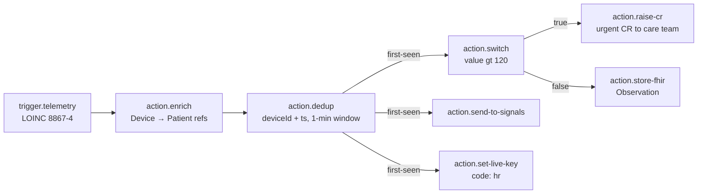

# IoT platform

Ovok's IoT surface turns device telemetry into FHIR resources + Signals
events through per-project rule-chains. This page is the operator's
map — model, endpoints, console UX, deployment.

Every backend endpoint below is admin-only (`RoleAdminGuard`); project
scoping is automatic via the caller's bearer token — clients cannot
spoof `meta.project`. Console pages soft-degrade with a "Waiting on
ovok-core deploy" card when an endpoint isn't live on the current
deployment, so you always know whether a UI stub is a bug vs a
deployment lag.

## Overview

Three moving parts, mapped to console URLs:

| Concept | Console URL | ovok-core surface |
|---------|-------------|-------------------|
| **Devices** — FHIR `Device` per serial number | `/devices` + `/devices/[id]` | `/v1/iot-device/{provision,devices,transport-config,observability}` |
| **Rule chains** — visual DAG authored per project | `/iot-builder` + `/iot-builder/[id]` | `/v1/iot-device/rule-chain/*` |
| **Signals** — landed observations + per-project routing | `/signals` + `/settings/iot/signals` | `/v1/signals/{observations,project-config}` |
| **Safety** — kill-flag + killswitch + capability grants | `/settings/general` + `/settings/iot/{killswitch,capabilities}` | project-settings + `/v1/iot-device/{killswitch,capabilities}` |

The chain workspace (`/iot-builder/[id]`) is a full-page palette +
DAG canvas + schema-driven inspector — no tabs, no raw-JSON detour.

## Device model

A device shows up in Ovok as a FHIR `Device` resource keyed by
**serial number** via `Device.identifier[system=OvokDeviceIdentifierSystem]`.
Both the admin `/provision` endpoint and the ingest hot-path materialize
devices atomically via Medplum's `createResourceIfNoneExist` (same
pattern as sleepiz's `DeviceInitializationRunner`) — repeated calls
with the same S/N converge to the same `Device/<S/N>` under any race,
so "auto-create on first ingest" is safe by construction.

```
Device/<internalId>              ← Medplum-generated UUID
├── identifier[]
│    └── { system: OvokDeviceIdentifierSystem,
│          value: <serialNumber> }   ← the S/N is the queryable key
├── serialNumber                 ← native FHIR field
├── deviceName[0].name           ← friendly display (defaults to S/N)
├── meta.project                 ← stamped by Medplum from the caller's token
├── patient?                     ← optional link
└── identifier[system=IOT_TOKEN_HASH_SYSTEM]?
                                  ← sha256(secret) once a token is minted
```

The token wire format is `iotk_<deviceId-b64url>_<32-byte-secret-b64url>`.
Only the sha256 hash is stored; the raw token is returned exactly ONCE
on mint / rotate through the console's once-visible reveal panel
(never persisted to browser storage — the primitive unmounts on
route change).

## Provisioning flow

Three legitimate paths a device can arrive on:

1. **Admin (recommended)** — `POST /v1/iot-device/provision`
   with `{ serialNumber, deviceName?, patientRef? }`. Idempotent.
   Console entry point: `/devices` → **+ New device**.
2. **First ingest** — a device that already has a token bound
   to its serial number can send telemetry and the ingest core
   materializes the FHIR Device on demand via the same
   `createResourceIfNoneExist` path — no separate call required.
3. **Raw FHIR** — power users can PUT a `Device` resource directly.
   Provided the identifier system + value match the S/N convention,
   the token/ingest flow works against it.

Once the `Device` exists, mint a token via
`POST /v1/iot-device/devices/:id/token` (console: token panel on
`/devices/[id]`). Response returns `{ token: "iotk_..." }` exactly once.

Configure the device firmware using the recipe from
`GET /v1/iot-device/transport-config` — never hard-code environment
URLs into firmware; the console's transport picker copies snippets
directly from that endpoint.

## Ingestion

Three transports flow through the same `IotIngestCoreService.ingest`
core (`verify → normalize → admit → enqueue`) so the executor stays
transport-blind. Discovery config lives at
`GET /v1/iot-device/transport-config` (never returns secrets) — HTTP
URL, MQTT broker + topic + user-property + QoS, WS URL + namespace +
event name — every field nullable when its env var is unset.

### HTTP

```
POST https://api.<env>.ovok.com/v1/iot-device/telemetry
x-iot-device-token: iotk_...
content-type: application/json

{ "payload": {...}, "reportedAt": "<ISO> | null", "schemaVersion": "<str> | null" }
```

- **Success** — `202 Accepted` with `{ "jobId": "<messageId>" }`.
- **401** — bad token OR `IOT_ENABLED=false` (deliberately
  indistinguishable). Console simulator surfaces both hints.
- **413** — `payload_too_complex` (structural limits: depth ≤ 32,
  ≤ 5000 nodes, arrays ≤ 2000, strings + keys ≤ 32768).
- **422** — body-size guard (raw bytes > 64 KiB).
- **429** — Nest throttler (600 req/min per bucket) or the
  per-project admission window (6000 msgs/60 s + 5000 max queue depth).

### MQTT

Topic pattern `iot/{deviceId}/telemetry`; token goes in the MQTT User-
Property (default key `x-iot-device-token`); QoS 1. Broker URL from
`transport-config.mqtt.brokerUrl`. Same body shape as HTTP.

### WebSocket

Socket.io namespace `/iot-telemetry`, event `telemetry`, token in
`socket.io` `auth: { token: 'iotk_…' }` on the handshake. Handshake auth
runs `IotIngestCoreService.verifyDeviceCredential` before the socket
ever reaches `connection`, so an unauthenticated upgrade is rejected
at the transport layer.

## Kill-flag: `IOT_ENABLED`

Project-level boolean on `Project.setting[]`. When `false`, HTTP + MQTT
+ WS ingest all reject at admission via
`IotIngestCoreService.verifyIotEnabled`. Fail-closed: a Medplum read
error is treated as "off" to prevent a transient blip from silently
opening a gated project.

Read / write via the existing project-settings surface:

```
GET  /v1/project/settings                    → includes IOT_ENABLED in the 9-key envelope
PUT  /v1/project/settings/IOT_ENABLED        → { enabled: boolean }
```

Console entry: **Settings → General → IoT ingestion**. When off, the
sidebar hides the IoT Builder + Devices + Signals entries and each
route renders an empty-state Card with a one-click enable path.

## Rule chains

Rule-chains are the per-project DAG that runs on every accepted
telemetry message. Each chain has a draft graph (freely editable)
and an optional last-published snapshot. Publishing snapshots the
draft; rollback restores the last published version into the draft.

### The graph model

```typescript
type RuleGraph = {
  nodes: {
    id: string;
    type: string;                     // e.g. "trigger.telemetry"
    config: Record<string, unknown> | null;
    position: { x: number; y: number } | null;
  }[];
  edges: {
    id: string;
    source: string;                   // node.id
    target: string;                   // node.id
    sourceHandle: string | null;      // 'true' / 'false' on branch nodes
  }[];
};
```

Backend limits: ≤ 200 nodes, ≤ 400 edges, serialized graph ≤ 256 KiB.
The console's `CodeArea` primitive clamps at the same value.

### Node catalog

Static registry served from
`GET /v1/iot-device/rule-chain/node-catalog`. Every node's
`configSchema` is a JSON-Schema draft-07 subset that both the console
inspector (form generation) and the backend validator (`invalid-config`
issue on Publish) read.

Categories:

- **`trigger.*`** — no inputs, one output. Fire on an incoming event.
  Two trigger types today: `trigger.telemetry` (device sent a reading)
  and `trigger.signal` (Signals threshold breached).
- **`condition.*`** — one input, `branch` outputs (`true`/`false` handles).
- **`action.*`** — one input, one output (or `branch` for `dedup`,
  `switch`, and `fetch-resource`). Do the work.

Full reference at `/iot-builder/catalog` on the console.

#### Selector syntax (Zapier-style cross-node references)

Any node config field that names a value on the message accepts one
of three **prefix-scoped selectors**, or a bare key which resolves as
if the caller had written `payload.<key>` (back-compat with early
switch chains):

| Selector                | Resolves to                     | Example                              |
| ----------------------- | ------------------------------- | ------------------------------------ |
| `payload.<key>`         | `message.payload[key]`          | `payload.heartRate`                  |
| `metadata.<key>`        | `message.metadata[key]`         | `metadata.patientRef`                |
| `nodes.<nodeId>.<key>`  | `message.outputs[nodeId][key]`  | `nodes.enrich-1.patientRef`          |
| `<bareKey>`             | `message.payload[bareKey]`      | `value` (equivalent to `payload.value`) |

**Dot depth past the first key segment is intentionally forbidden**
(e.g. `payload.a.b` treats `a.b` as a literal key). Keeps parsing
linear-scan; matches switch's original contract. Chains that need
deeper drilling wire an `action.lua` node in between.

Consuming nodes: `condition.threshold`, `action.switch`,
`condition.exists`, `action.dedup` (per key), `action.set-live-key`
(via `valueFrom`).

Producing nodes (declare a `produced` bag under their `node.id`):

- **`action.enrich`** → `deviceRef`, `deviceDisplay`, `patientRef`
- **`action.fetch-resource`** → the fetched resource under
  `<outputField>`, plus `resourceType` + `id`.

#### Trigger.signal (Signals inbound)

`trigger.signal` fires **after** the ordinary Signals OOB / CR
reaction completes on the per-project signals processor. The
`SignalRuleDispatcherService` (in ovok-core's rule-engine module)
lists every published chain in the project whose root is
`trigger.signal` and runs each synchronously — no queue hop, no
retry surface. A rule-chain failure is swallowed inside the
dispatcher; the Signals path is never taken down by a bad user
chain.

The alert becomes the flat `payload`:

```json
{
  "alertId":     "…",
  "event":       "threshold-breach",
  "patient":     "Patient/pat-1",
  "patientRef":  "Patient/pat-1",
  "deviceRef":   "Device/dev-1",
  "code":        "8867-4",
  "value":       128,
  "message":     "HR above upper limit",
  "observedAt":  "2026-07-09T13:12:00Z",
  "createdAt":   "2026-07-09T13:12:01Z",
  "alert":       { "…full alert dto…": "…" }
}
```

Per-run metadata carries `triggerKind: 'signal'`,
`transport: 'signals-webhook'`, plus `alertId / patientRef /
deviceRef / triggerCode / triggerDisplay`. Config filters (optional):

```ts
{
  loinc?:    string;                                   // filter on trigger code
  event?:    string;                                   // filter on alert.event
  severity?: 'any' | 'info' | 'warning' | 'critical';  // default 'any'
}
```

Filters aren't applied yet at the executor level (v1 fires every
signal-rooted chain for every alert; author-controlled short-circuits
via `condition.*` are the pragmatic path). The filter fields are
reserved so a follow-up can index chains by these without a schema
break.

#### Action.fetch-resource (Zapier-style FHIR read)

Reads a resource from Ovok by id OR single-match search filter,
force-scoped to the current project. Every read is capability-gated
(`fetch-resource` in `HIGH_RISK_NODE_CLASSES`) — default-deny per
project until an operator grants it explicitly on
`Project.extension[iot-enabled-node-classes]`.

```ts
{
  resourceType:  'Patient' | 'Device' | 'Observation' | 'Encounter' |
                 'CommunicationRequest' | 'DiagnosticReport' |
                 'ServiceRequest' | 'Practitioner' | 'Organization' |
                 'Location';
  id?:           string;                     // exactly one of…
  searchFilter?: {                           // …id or searchFilter
    identifier?:   string | number;
    code?:         string | number;
    patient?:      string | number;
    subject?:      string | number;
    device?:       string | number;
    status?:       string | number;
    date?:         string | number;
    _lastUpdated?: string | number;
    _sort?:        string | number;
    _count?:       string | number;
    _offset?:      string | number;
  };
  into?:        'payload' | 'metadata';      // default 'metadata'
  outputField?: string;                      // default 'fetched'
}
```

Guarantees:

1. `resourceType` allowlist — admin-plane resources (`Project`,
   `ProjectMembership`, `Bot`, `User`, `AccessPolicy`) cannot be
   fetched by a chain.
2. `_project` is FORCE-injected into every search — a caller-supplied
   `_project` in `searchFilter` is stripped (Zod rejects it anyway).
3. Post-read `meta.project === ctx.projectId` check. Stray cross-
   project result → routes Failure with `metadata.fetchError =
   'cross-project'`.
4. Missing resource routes `Failure` with `metadata.fetchError`
   set to `'not-found'` (id) or `'no-match'` (search). Handler NEVER
   throws on missing — the chain author gets a proper branch, not
   a BullMQ retry.

The fetched resource lands under `message.metadata[outputField]` by
default (opt into `message.payload[outputField]` via `into: 'payload'`)
AND on the per-node produced bag, so downstream nodes can address it
via `nodes.<fetchNodeId>.<outputField>`.

#### Condition.exists

Pairs with `fetch-resource`. Routes `True` iff the selector resolves
to a non-null value. Config: `{ from: <selector> }`. Zero side effects.

#### Condition.threshold

Numeric compare using the selector syntax. Config:
`{ from: <selector>, op: '>' | '>=' | '<' | '<=' | '==' | '!=',
value: number }`. Non-numeric or missing input routes **False**
(Zapier convention — a chain author expects "did this reading
breach?" to always be answerable).

### The workspace

`/iot-builder/[id]` is a single-screen authoring workspace, no tabs:

```
┌───────────────────────────────────────────────────────────────┐
│  ← Chains   name · v3 · draft   ID   Simulate · Safety · Save · Publish │
├──────────┬────────────────────────────────┬───────────────────┤
│ Palette  │           Canvas                │  Inspector        │
│ · filter │  drag from palette / connect    │  · schema-driven  │
│ · groups │  handles / backspace to delete  │  · code editor    │
│ · drag   │                                 │  · delete node    │
└──────────┴────────────────────────────────┴───────────────────┘
```

- **Palette (left)** — filterable list of catalog nodes grouped by
  category. Drag any card onto the canvas to add a node with a
  fresh id + default config.
- **Canvas (middle)** — `@xyflow/react`. Kind-tinted custom nodes
  (`trigger` = ovok-deep, `condition` = signal-warn, `action` =
  signal-ok). Branch handles labelled `true` / `false` on
  `condition.threshold` + `action.switch` + `action.dedup`.
  `isValidConnection` blocks self-loops, edges into triggers, and
  duplicate `(source, target, sourceHandle)` combos at drag-time
  (backend validator is still authoritative on Publish).
- **Inspector (right)** — reads the selected node's `configSchema`
  and renders the appropriate primitive per field:
  - `type: 'boolean'` → Toggle
  - `enum` → `<select>`
  - `type: 'number' \| 'integer'` → Number Input (with min/max/step)
  - `type: 'string'` + name looks like code (`script`/`code`/`lua`/`sql`
    or `format: 'code'`) → CodeArea (monospace + tab-indent)
  - `type: 'string'` → text Input
  - object / array → CodeArea JSON fallback

So `action.lua` opens with a real code editor for the `script`
field, `condition.threshold` gets a `<select>` for `op` + number
input for `value`, `trigger.telemetry` gets a text input for
`loinc`. Zero raw-JSON exposure unless the schema forces it.

### Templates

Three starter templates in the workspace's **Load template**
dropdown (JSON tab). Loading overwrites the graph but preserves
`name` + `status`. See [Sleepiz-style example](#example-sleepiz-style-ingestion-flow)
below for the canonical multi-vital shape.

## Safety controls

Two independent brake systems + one capability gate:

### Chain breaker (automatic, per-chain)

`IotChainBreakerService` — tracks consecutive execution failures per
`(projectId, chainId)`. When the count crosses
`IOT_CHAIN_BREAKER_THRESHOLD` inside `IOT_CHAIN_BREAKER_WINDOW_MS`, the
disabled key is stamped with its own TTL and subsequent messages
fail-open (no-op) instead of retry-storming. Success resets the
counter so the breaker measures CONSECUTIVE failures, not lifetime.

Read state via `GET /v1/iot-device/observability/chain/:id` — the
console renders a live-polling **chain-breaker card** on
`/iot-builder/[id]` (Safety drawer). Trips automatically; no admin
action to clear (waits for the TTL).

### Killswitch (manual, three scopes)

`IotKillswitchService` — any truthy Redis value at any of the three
keys short-circuits the executor:

- `iot:global:killswitch` — global brake (super-admin only).
- `iot:{projectId}:killswitch` — per-project brake.
- `iot:{projectId}:killswitch:chain:{chainId}` — per-chain brake.

Admin surface:

```
GET  /v1/iot-device/killswitch/:scope[?chainId=…]     → status
PUT  /v1/iot-device/killswitch/:scope                 → set/clear
```

Console: **Settings → IoT killswitch** (project + global; global
gated on super-admin). Chain-scope toggle lives in the workspace's
Safety drawer alongside the breaker card.

**Fail-open on Redis outage** — a Redis blip won't accidentally lock
the engine. The operator opts into the strict semantics by choosing
Redis health as a dependency.

### Capability grants (project-scoped)

High-risk node classes require an explicit operator grant on
`Project.extension[PROJECT_IOT_ENABLED_NODE_CLASSES_EXT]`. Four
classes today:

| Class | Nodes | What it does |
|-------|-------|-------------|
| `external-webhook` | `action.webhook` | POST to arbitrary external HTTPS. Egress allowlist gated. |
| `execute-bot` | `action.bot` | Run a Medplum server-side bot. |
| `store-fhir` | `action.store-fhir` + `action.raise-cr` | Write Observation / CommunicationRequest. |
| `raise-cr` | `action.raise-cr` | Sub-grant specifically for raising CRs. |

Missing grant → publish 422 with `code: capability-denied`. The
console cross-links the validation report entry directly to the
matching row on **Settings → IoT capabilities**. Grants themselves
are super-admin only (write); this admin surface is read-only.

## Per-project Signals

Signals is Ovok's alerting / event-bus tier. By default every project
routes through the shared Carehub Signals install (`source: "global"`).
Projects can opt into their own tenant via `PUT /v1/signals/project-config`
to isolate event streams and apiKeys.

Console surface: **Settings → Signals tenant**. Renders three states:

- **Global** — read-only "Using shared Signals install" + admin CTA
  to provision own tenant.
- **Project (provisioned)** — read card with `baseUrl`, `tenantId`,
  `submitterId`, `managerId`, `subscriberId`, `hasApiKey`,
  `hasWebhookSecret` + three actions:
  - **Test connection** — non-mutating probe; renders `authOk` +
    `subscriberOk` + `source` chips.
  - **Rotate webhook secret** — new secret shown ONCE.
  - **Revoke** — typed-tenant-id confirm; reverts to global.
- **Partial** — red banner "Signals config inconsistent — complete
  or delete."

Webhook signing secret is returned exactly once on both provision
and rotate; same once-visible `KeyRevealPanel` primitive as device
tokens.

### Signals-landed observations

`GET /v1/signals/observations?patient=&code=&_since=&_count=` returns
Observations whose `identifier[]` includes a system starting with
`SIGNALS_SYSTEM` (`https://signals.actimi.com/*`) — filters to both
`/observation` and `/alert` identifier flavors. Cross-references
`CommunicationRequest`s via `basedOn`.

Console: **Signals** (top-level sidebar). List + drill-in showing
the full Observation JSON + Signals-specific extensions (payload,
message, value, reason) + linked CRs.

## Example: Sleepiz-style ingestion flow

Ships as the default "Load template" pick on the JSON tab. Full
eight-node multi-vital shape the sleepiz project uses in production
(see [`DeviceInitializationRunner`](https://github.com/Actimi/ovok-core/blob/sandbox/src/ingest/device-initialization.runner.ts)
+ [`ingest.controller.ts`](https://github.com/Actimi/ovok-core/blob/sandbox/src/ingest/ingest.controller.ts))
translated to rule-chain nodes:



### Node-by-node

- **`trigger.telemetry`** — fires on any device telemetry matching
  the LOINC filter. `8867-4` = heart rate. Swap for `9279-1`
  (breathing rate), `59408-5` (SpO2), or `81509-1` (out-of-bed) to
  reuse the same graph for other vitals.
- **`action.enrich`** — reads the Device (by the token-derived id)
  + its linked Patient; attaches both as metadata so downstream
  nodes get `deviceRef` + `patientRef` for free. Self-serve.
- **`action.dedup`** — first-seen (`true`) vs repeat (`false`).
  Keyed on `deviceId + ts` with label `sleepiz-hr-1min`. Repeats
  dead-end silently on the `false` handle. Self-serve.
- **`action.switch`** — branching threshold. `from: "value"`,
  `op: "gt"`, `value: 120` — HR above 120 bpm routes `true`,
  everything else `false`. Self-serve.
- **`action.raise-cr`** — creates `CommunicationRequest` with
  `priority: urgent`. **High-risk** — needs the `raise-cr` grant.
- **`action.store-fhir`** — persists as `Observation` on the FHIR
  store. **High-risk** — needs the `store-fhir` grant.
- **`action.send-to-signals`** — resolves the project's Signals
  tenant + stamps tenant identity. Self-serve.
- **`action.set-live-key`** — writes the payload's `value` to Redis
  under code `hr` for last-known-value dashboards. Self-serve.

### Adapting

Two knobs per deployment:

1. **LOINC on the trigger** — swap `8867-4` for the vital your
   device reports. The rest of the chain is code-agnostic.
2. **Threshold on the switch** — `120` is the HR bound; use `< 12`
   for BR bradypnea, `< 90` for SpO2 desat, etc.

Everything else — the enrich → dedup → fan-out shape — carries
over verbatim. Same shape sleepiz runs against Hartmann-tenant
production traffic today, just parameterized.

## Testing with the simulator

The console ships a raw HTTP telemetry simulator that fires real
ingest requests — same wire path a production device uses, no FHIR
detour. Available two places:

1. **`/devices/[id]`** — `TelemetrySimulator` card below the
   transport picker. Device is already known.
2. **`/iot-builder/[id]`** — **Simulate** button on the workspace
   action bar → right-side drawer, payload seeded from the first
   `trigger.telemetry` node's config.

### End-to-end recipe

1. **Load** — `/iot-builder/[chain-id]` → JSON tab → **Load
   template → Sleepiz-style ingestion (HR)** → Save.
2. **Grants** — **Settings → IoT capabilities**. If `raise-cr` +
   `store-fhir` aren't granted, request them; publish otherwise
   422s with `capability-denied`.
3. **Provision** — `/devices` → **+ New device** → serial
   `SLPZ-TEST-01` (any string). Mint the token; copy `iotk_…` once.
4. **Send** — on `/devices/[id]`, in the **Simulate** card, paste
   the token + POST a body like:
   ```json
   {
     "value": 145,
     "unit": "bpm",
     "deviceId": "SLPZ-TEST-01",
     "ts": "2026-07-09T12:00:00Z"
   }
   ```
5. **Verify** — response panel shows `202` + `jobId`. On the
   ovok-core side, a `CommunicationRequest` (`priority: urgent`)
   lands on the project, an `Observation` lands, and the Signals
   tenant receives the event.

### Response decoding

The simulator decodes ovok-core status codes with concrete hints:

| Status | Meaning | Hint |
|--------|---------|------|
| `202` | Accepted | `jobId` = internal `messageId` (used for dedup + trace correlation). |
| `401` | Unauthorized | Bad token OR `IOT_ENABLED=false`. Deliberately indistinguishable server-side; check both. |
| `413` | Payload too complex | Structural limits: depth ≤ 32, ≤ 5000 nodes, arrays ≤ 2000, strings ≤ 32768. |
| `422` | Body too large | Raw bytes > 64 KiB. The composer clamps at the same value client-side. |
| `429` | Rate limited | HTTP throttler (600/min) or admission window (6000/min + 5000 queue depth). |

Token is held in memory only — never persisted to localStorage,
never sent anywhere but ovok-core through the console's server-side
proxy.

## Console surfaces

Full URL map for the IoT feature set:

| URL | Purpose |
|-----|---------|
| `/iot-builder` | Rule-chain list. Row → detail. `+ New chain` opens a minimal empty-graph draft. |
| `/iot-builder/[id]` | Full-page authoring workspace — palette + canvas + inspector. Simulate + Safety drawers. |
| `/iot-builder/catalog` | Read-only node-catalog reference. Copy-stub button per entry. |
| `/devices` | Device list. `+ New device` opens the S/N-keyed provision modal. |
| `/devices/[id]` | Token panel (mint/rotate/revoke) + three-tab transport picker + observability rail + telemetry simulator. |
| `/signals` | Signals-landed observations list with filters. |
| `/signals/[observationId]` | Full observation JSON + Signals extensions + linked CRs. |
| `/settings/general` | Project settings incl. `IOT_ENABLED` toggle. |
| `/settings/iot/signals` | Per-project Signals tenant provisioning + rotate + test + revoke. |
| `/settings/iot/capabilities` | Read-only high-risk capability grants. |
| `/settings/iot/killswitch` | Project + global killswitch (chain-scope on the chain workspace). |

Sidebar visibility for IoT entries respects `IOT_ENABLED`: when off,
the Project section drops the IoT Builder / Devices / Signals rows
and each route renders an empty-state Card with a one-click enable
path.

## API reference

Full HTTP contract auto-generated from the ovok-core Swagger dump
into [High Level API → IotDevice/Admin](../../api/high-level/) and
[High Level API → Signals](../../api/high-level/). Endpoint index
here for the operator-facing view:

| Method | Path | Purpose |
|--------|------|---------|
| `POST` | `/v1/iot-device/provision` | Create (or match existing) `Device/<S/N>`. Idempotent. |
| `GET`  | `/v1/iot-device/devices` | List Devices scoped to caller's project. |
| `POST` | `/v1/iot-device/devices/:id/token` | Mint iotk\_… (once-visible). |
| `POST` | `/v1/iot-device/devices/:id/token/rotate` | Rotate iotk\_… (once-visible). |
| `DELETE` | `/v1/iot-device/devices/:id/token` | Revoke iotk\_… (Device stays). |
| `GET`  | `/v1/iot-device/transport-config` | HTTP/MQTT/WS discovery (no secrets). |
| `GET`  | `/v1/iot-device/observability/device/:id` | `lastTelemetryAt` + brake state. |
| `GET`  | `/v1/iot-device/observability/chain/:id` | Breaker + brake state per chain. |
| `GET`  | `/v1/iot-device/capabilities` | High-risk grants for caller project. |
| `GET`/`PUT` | `/v1/iot-device/killswitch/:scope` | Read/set killswitch. |
| `GET`  | `/v1/iot-device/rule-chain` | List rule-chains. |
| `POST` | `/v1/iot-device/rule-chain` | Create draft chain. |
| `GET`  | `/v1/iot-device/rule-chain/node-catalog` | Static node registry. |
| `GET`/`PUT` | `/v1/iot-device/rule-chain/:id` | Read / update draft. |
| `POST` | `/v1/iot-device/rule-chain/:id/validate` | Lint the draft. Always 200. |
| `POST` | `/v1/iot-device/rule-chain/:id/publish` | Snapshot draft as published. 422 on invalid. |
| `POST` | `/v1/iot-device/rule-chain/:id/rollback` | Restore published into draft. |
| `POST` | `/v1/iot-device/telemetry` | HTTP ingest. `x-iot-device-token` header. |
| `GET`  | `/v1/signals/project-config` | Per-project Signals config (no secret echo). |
| `PUT`  | `/v1/signals/project-config` | Provision per-project Signals (returns secret ONCE). |
| `POST` | `/v1/signals/project-config/rotate-webhook-secret` | Rotate secret (ONCE). |
| `POST` | `/v1/signals/project-config/test-connection` | Non-mutating probe. |
| `DELETE` | `/v1/signals/project-config` | Revoke → back to global routing. |
| `GET`  | `/v1/signals/observations` | Signals-landed observations list. |

## Environment configuration

Deployment-level env vars the IoT surface reads:

| Env var | Purpose | Default |
|---------|---------|---------|
| `OVOK_PUBLIC_URL` | HTTP + WS public endpoint | Falls back to `OVOK_INTERNAL_PUBLIC_URL` |
| `MQTT_BROKER_URL` | MQTT broker URL | Not configured — MQTT off |
| `MQTT_TELEMETRY_TOPIC_PATTERN` | Topic layout | `iot/{deviceId}/telemetry` |
| `MQTT_DEVICE_TOKEN_USER_PROPERTY` | MQTT User-Property key | `x-iot-device-token` |
| `MQTT_QOS` | Publish QoS | `1` |
| `IOT_HTTP_MAX_BODY_BYTES` | HTTP body cap | `65536` (64 KiB) |
| `IOT_WS_NAMESPACE` | socket.io namespace | `/iot-telemetry` |
| `IOT_WS_EVENT_NAME` | socket.io event | `telemetry` |
| `IOT_CHAIN_BREAKER_THRESHOLD` | Consecutive fails to trip | See consts |
| `IOT_CHAIN_BREAKER_WINDOW_MS` | Rolling window | See consts |
| `IOT_ADMISSION_MAX_PER_WINDOW` | Per-project ingest cap | `6000` |
| `IOT_ADMISSION_WINDOW_MS` | Rolling window | `60000` |
| `IOT_MAX_QUEUE_DEPTH_PER_PROJECT` | Bounded queue depth | `5000` |

`GET /v1/iot-device/transport-config` echoes the discovery values
back to the console — no console-side env-var duplication.

## Debugging

### "Waiting on ovok-core deploy"

When the deployed ovok-core doesn't yet know an endpoint the
console calls, Nest returns `{ message: "Cannot GET /v1/…", ... }`.
The console's `isRouteMissing` helper (`lib/api.ts`) recognizes
this specific 404 shape and renders a friendly "Waiting on
ovok-core deploy" card citing the exact backend commit that ships
the missing endpoint. So a stale alpha environment never surfaces as a
mysterious raw-Nest error.

Pages with the soft-degrade wired: `/signals`, `/devices`,
`/devices/[id]`, `/iot-builder/[id]`, `/settings/iot/capabilities`,
`/settings/iot/killswitch`.

### Recent additions timeline

| Ovok-core commit | Ships | Console consumer |
|------------------|-------|------------------|
| `42b0f0c7` | b0 · `IOT_ENABLED` kill-flag | S-GRAFT-0 · `/settings/general` toggle |
| `8ff3d44c` | b1+b2+b3 · devices + token routes + transport-config | S-GRAFT-2 · `/devices` + transport picker |
| `ce16bcbe` | b5+b6 · killswitch write + capabilities read | S-GRAFT-3+4 · killswitch + capabilities pages |
| `e3e1402c` | b4 · observability aggregates + heartbeat | S-GRAFT-3 · device rail + chain breaker |
| `4c73052b` | b7 · signals-observations list | S-GRAFT-6 · `/signals` |
| `d57166fa` | Admin device provisioning | `/devices` "+ New device" |
| `4e1e9d4b` | Provision keyed by `serialNumber` (sleepiz pattern) | Console dialog with S/N field |
| `984cfd0b` | Railway config pin | Deploy verification |

## References

- Console-side slice plan: [`docs/iot-builder/PLAN.md`](https://github.com/Actimi/ovok-console/blob/sandbox/docs/iot-builder/PLAN.md) + [`PLAN-v2.md`](https://github.com/Actimi/ovok-console/blob/sandbox/docs/iot-builder/PLAN-v2.md) on ovok-console.
- Console-side API index: [`docs/iot-builder/API.md`](https://github.com/Actimi/ovok-console/blob/sandbox/docs/iot-builder/API.md) on ovok-console.
- Ovok-core rule-chain source: [`src/iot-device/rule-chain/*`](https://github.com/Actimi/ovok-core/tree/sandbox/src/iot-device/rule-chain).
- Sleepiz ingest pattern (source of the template): [`src/ingest/*`](https://github.com/Actimi/ovok-core/tree/sandbox/src/ingest).
- OpenAPI (auto-generated): [High Level API](../../api/high-level/).
