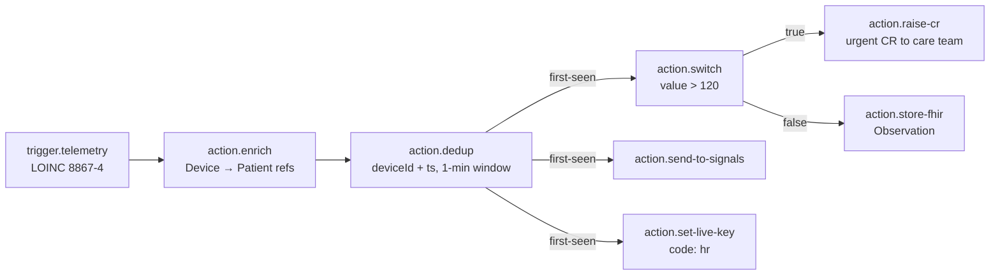

# IoT platform

Ovok's IoT surface takes device telemetry through three transports
(HTTP / MQTT / WebSocket), runs it through per-project rule-chains,
and produces FHIR resources + Signals events. Every endpoint below
is admin-only (`RoleAdminGuard`); project scoping is automatic via
the caller's bearer token — clients cannot spoof `meta.project`.

## Model

A device shows up in Ovok as a FHIR `Device` resource keyed by
**serial number**. When you provision a device (admin flow) or when
one first ingests telemetry, the resource is created atomically via
`createResourceIfNoneExist` with an
`identifier[system=OvokDeviceIdentifierSystem]` anchor — repeated
calls with the same serial number converge to the same `Device/<S/N>`,
so you get "device auto-creation" without duplicates under any race.

```
Device/<serialNumber>            ← primary identity
├── identifier[]                  ← { system: OvokDeviceIdentifierSystem, value: <S/N> }
├── serialNumber                  ← native FHIR field
├── deviceName[0].name            ← friendly display (defaults to S/N)
├── meta.project                  ← stamped by Medplum from the caller's token
└── patient?                      ← optional link to Patient
```

Each device optionally carries a per-device access token
(`iotk_…`) — a wire secret whose sha256 hash is stored on
`Device.identifier[]` under `IOT_TOKEN_HASH_SYSTEM`. Plaintext is
returned exactly ONCE at mint/rotate; the console displays it via a
copy-once panel that never persists to browser storage.

## Provisioning flow

1. **Admin**: `POST /v1/iot-device/provision` with `{ serialNumber, deviceName?, patientRef? }`.
   Creates (or matches existing) `Device/<S/N>` atomically. Idempotent.
2. **Admin**: `POST /v1/iot-device/devices/:id/token` — mint the raw `iotk_…` token.
   Copy it into the device firmware. Ovok stores only the hash.
3. **Device firmware**: send telemetry against the chosen transport.
   The endpoint URL / topic pattern / auth header comes from
   `GET /v1/iot-device/transport-config` — never encode env-specific
   URLs into firmware directly.

The console's `/devices` page implements this end-to-end: `+ New
device` → detail page with token panel + three-tab transport picker.

## Kill-flag: `IOT_ENABLED`

Every project has an `IOT_ENABLED` setting on `Project.setting[]`. When
`false`, HTTP + MQTT + WS ingest all reject at admission — HTTP `401`,
MQTT drop-with-log, WS handshake reject. Read/write through the
existing project-settings surface (`GET /v1/project/settings`,
`PUT /v1/project/settings/IOT_ENABLED`). Fails closed on Medplum read
errors — a transient blip cannot silently open a gated project.

## Safety controls

Two independent brake systems:

- **Chain breaker** — automatic, per-chain. Trips after
  `IOT_CHAIN_BREAKER_THRESHOLD` consecutive execution failures inside
  a rolling window. Subsequent messages fail-open (no-op) until the
  disabled key expires. Read state via
  `GET /v1/iot-device/observability/chain/:id`.
- **Killswitch** — manual, three scopes (`global` / `project` / `chain`).
  Any truthy value at any scope short-circuits the executor. Admin-
  writable via `PUT /v1/iot-device/killswitch/:scope`. Fails open on
  Redis outage (a Redis blip won't accidentally lock the engine).

## High-risk node capabilities

Rule-chain node classes marked "high-risk" (`external-webhook`,
`execute-bot`, `store-fhir`, `raise-cr`) require an explicit
operator grant on `Project.extension[PROJECT_IOT_ENABLED_NODE_CLASSES_EXT]`.
Read grants via `GET /v1/iot-device/capabilities`; writes stay
superadmin-only. Publish attempts on chains using ungranted classes
return `422` with `code: capability-denied`.

## Per-project Signals

By default every project routes Signals traffic through the shared
Carehub Signals install (`source: "global"`). Provision your own
tenant via `PUT /v1/signals/project-config` to isolate event streams
+ apiKeys. Webhook signing secret is returned exactly once on
provision + rotate.

## What lands where

| Endpoint | Purpose | Console consumer |
|----------|---------|------------------|
| `POST /v1/iot-device/provision` | Create `Device/<S/N>` (idempotent) | `/devices` "+ New device" modal |
| `GET /v1/iot-device/devices` | List devices | `/devices` list |
| `POST /v1/iot-device/devices/:id/token` | Mint token (once-visible) | `/devices/[id]` token panel |
| `POST /v1/iot-device/devices/:id/token/rotate` | Rotate token | `/devices/[id]` token panel |
| `DELETE /v1/iot-device/devices/:id/token` | Revoke token | `/devices/[id]` token panel |
| `GET /v1/iot-device/transport-config` | HTTP/MQTT/WS recipes | `/devices/[id]` transport picker |
| `GET /v1/iot-device/observability/device/:id` | Last telemetry / brake state | `/devices/[id]` rail |
| `GET /v1/iot-device/observability/chain/:id` | Breaker + brake state | `/iot-builder/[id]` header |
| `GET/PUT /v1/iot-device/killswitch/:scope` | Read/set kill-flag | `/settings/iot/killswitch` |
| `GET /v1/iot-device/capabilities` | High-risk grants | `/settings/iot/capabilities` |
| `/v1/iot-device/rule-chain/*` | Rule-chain CRUD + publish + validate | `/iot-builder` + `/iot-builder/[id]` |
| `/v1/signals/project-config/*` | Per-project Signals admin | `/settings/iot/signals` |
| `GET /v1/signals/observations` | Signals-landed observations | `/signals` + drill-in |

The full HTTP contract for each — request bodies, response shapes,
error semantics — is under [High Level API](../../api/high-level/)
in this docs site. This page is the model + safety overview.

## Example: Sleepiz-style ingestion flow

This is the shape a real vitals device (heart rate, breathing rate,
SpO2, out-of-bed) ends up with by the time it's landing in Ovok. Ships
as a one-click template on the console — pick **Load template →
Sleepiz-style ingestion (HR)** in the JSON editor. Copies verbatim
into a rule-chain draft and passes the validator (assuming the
project has grants for `raise-cr` + `store-fhir`).



### What each node does

- **`trigger.telemetry`** — fires on any device telemetry matching the
  LOINC filter. `8867-4` = heart rate. Swap for `9279-1` (breathing
  rate), `59408-5` (SpO2), or `81509-1` (out-of-bed) to reuse the
  same graph shape for other vitals.
- **`action.enrich`** — reads the Device by id (from the token
  binding) and its linked Patient, attaches both as metadata on the
  message. Downstream nodes get `deviceRef` + `patientRef` for free.
  Self-serve — no capability grant needed.
- **`action.dedup`** — routes on first-seen (project-scoped key)
  vs repeat. Configured to key on `deviceId + ts` with the label
  `sleepiz-hr-1min`, so a device that retries the exact same
  timestamp (retry loop, at-least-once transport) only fires the
  chain once. Repeats dead-end silently on the `false` handle.
- **`action.switch`** — the branching threshold. `from: "value"`,
  `op: "gt"`, `value: 120` — HR above 120 bpm routes to the `true`
  handle (alert path), everything else to `false` (routine path).
- **`action.raise-cr`** — creates a `CommunicationRequest` for the
  patient's care team with `priority: urgent`. Requires the
  `raise-cr` capability grant (high-risk).
- **`action.store-fhir`** — persists the reading as an `Observation`
  resource on the project's FHIR store. Requires the `store-fhir`
  capability grant (high-risk).
- **`action.send-to-signals`** — resolves the project's Signals
  tenant (per-project via `/v1/signals/project-config` or the shared
  global fallback) and stamps tenant identity on the message so it
  lands in the right event bus. Self-serve.
- **`action.set-live-key`** — writes the payload's `value` field to
  Redis under the code `hr` so downstream dashboards can read
  `last-known heart rate` without a FHIR query. Self-serve.

### Adapting the template

Two knobs to change per deployment:

1. **LOINC on the trigger** — swap `8867-4` for the vital your
   device reports. The rest of the chain is code-agnostic.
2. **Threshold on the switch** — `120` is the HR bound; use `< 12`
   for BR bradypnea, `< 90` for SpO2 desat, etc. `op` accepts
   `equals`, `not-equals`, `gt`, `gte`, `lt`, `lte`, `contains`.

Everything else — the enrich → dedup → fan-out shape — carries over
verbatim. It's the same shape sleepiz uses in production for
Hartmann-tenant HR/BR/OOB ingestion (see the underlying
[`DeviceInitializationRunner`](https://github.com/Actimi/ovok-core/blob/sandbox/src/ingest/device-initialization.runner.ts)
+ [`ingest.controller.ts`](https://github.com/Actimi/ovok-core/blob/sandbox/src/ingest/ingest.controller.ts)),
translated into rule-chain nodes so any project can wire it up
without a code change.

### End-to-end test with the console simulator

1. **Load** — on `/iot-builder/[chain-id]`, click **Load template →
   Sleepiz-style ingestion (HR)** in the JSON tab. Save the draft.
2. **Grants** — Settings → IoT capabilities. If `raise-cr` and
   `store-fhir` aren't granted, request them; publish will 422 with
   `capability-denied` otherwise.
3. **Provision** — `/devices` → **+ New device** → serial `SLPZ-TEST-01`
   (or any string). Mint a token; copy the raw `iotk_…` once.
4. **Send** — on the device detail page, in the **Simulate** card,
   paste the token and POST a body like:
   ```json
   { "value": 145, "unit": "bpm", "deviceId": "SLPZ-TEST-01", "ts": "2026-07-09T12:00:00Z" }
   ```
5. **Watch** — the response panel shows 202 with a `jobId`; the
   chain runs; a `CommunicationRequest` with `priority: urgent` lands
   on the project; the Signals tenant receives the event.

## Environment configuration

Deployment-level env vars the IoT surface reads:

| Env var | Purpose | Fallback |
|---------|---------|----------|
| `OVOK_PUBLIC_URL` | HTTP + WS public endpoint | `OVOK_INTERNAL_PUBLIC_URL` |
| `MQTT_BROKER_URL` | MQTT broker URL | Not configured (MQTT off) |
| `MQTT_TELEMETRY_TOPIC_PATTERN` | Topic layout, e.g. `iot/{deviceId}/telemetry` | Default pattern |
| `MQTT_DEVICE_TOKEN_USER_PROPERTY` | MQTT User-Property key for the token | `x-iot-device-token` |
| `MQTT_QOS` | Publish QoS | `1` |
| `IOT_HTTP_MAX_BODY_BYTES` | HTTP body cap | `65536` |
| `IOT_WS_NAMESPACE` | Socket.io namespace | `/iot-telemetry` |
| `IOT_WS_EVENT_NAME` | Socket.io event | `telemetry` |
| `IOT_CHAIN_BREAKER_THRESHOLD` | Consecutive failures to trip | See consts |
| `IOT_CHAIN_BREAKER_WINDOW_MS` | Rolling window | See consts |

All discovery values are exposed to admins via
`GET /v1/iot-device/transport-config` so the console never hard-codes
deployment URLs.

## References

- OpenAPI (auto-generated): [High Level API → IotDevice/Admin](../../api/high-level/)
- Rule-chain schema + node catalog: [High Level API → IotDevice/RuleChain](../../api/high-level/)
- Signals model: [High Level API → Signals](../../api/high-level/)
- Console-side slice plan: `docs/iot-builder/PLAN-v2.md` in `Actimi/ovok-console`
