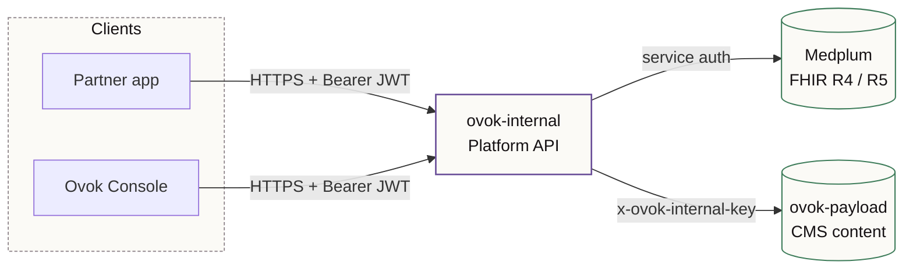
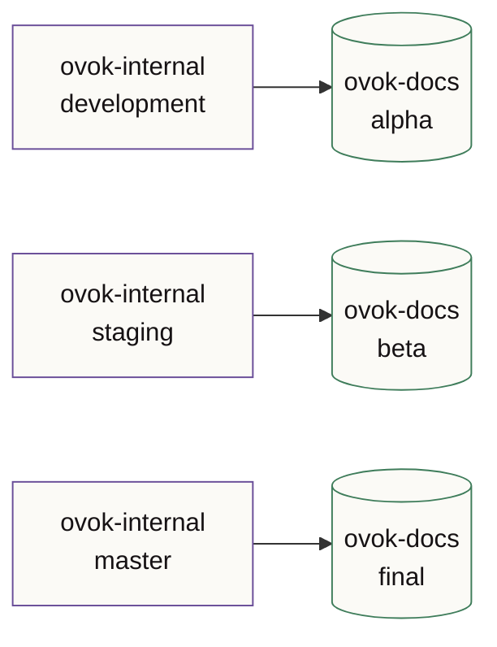

# Architecture

Ovok runs as a small set of cooperating services. Each one has a single,
clearly-scoped responsibility — and a corresponding repo.

## Repos at a glance

| Repo | Role | Hostname |
| --- | --- | --- |
| `ovok-internal`  | Platform API. NestJS app sitting in front of Medplum, handling auth, billing, content, signals, devices. | <ApiBase /> |
| `ovok-console`   | Next.js operator console. Project setup, members, content and billing live here. | <ApiBase surface="console" /> |
| `ovok-payload`   | Payload CMS for marketing pages and in-product content. Read by the Console, written by content editors. | internal |
| `medplum`        | The FHIR data plane. R4 + R5, accessed through `ovok-internal` (never directly by clients). | <ApiBase surface="fhir" /> |
| `ovok-docs`      | This site. Built from the contents of the four repos above. | docs.ovok.com |

## Data flow — request path

A few things worth noting about this picture:

- Clients **never** call Medplum directly. The platform API mediates
  auth, project scoping, and on-behalf-of audit headers.
- The Console talks to the same API every external integration does —
  there's no privileged "console-only endpoint."
- Audit history is written into Medplum's `vHistory` and surfaced back
  via the platform API's change-history endpoint.

## Release surfaces and source branches

## Deployment shape

Production runs on AWS ECS (one cluster per environment). Cross-service
networking inside Railway uses internal hostnames; public hostnames are
only assigned where an external integration actually needs one.

The release surface you see here (*alpha*, *beta*, *final*) maps directly
onto deployment environments — see [Environments](./environments.md).
